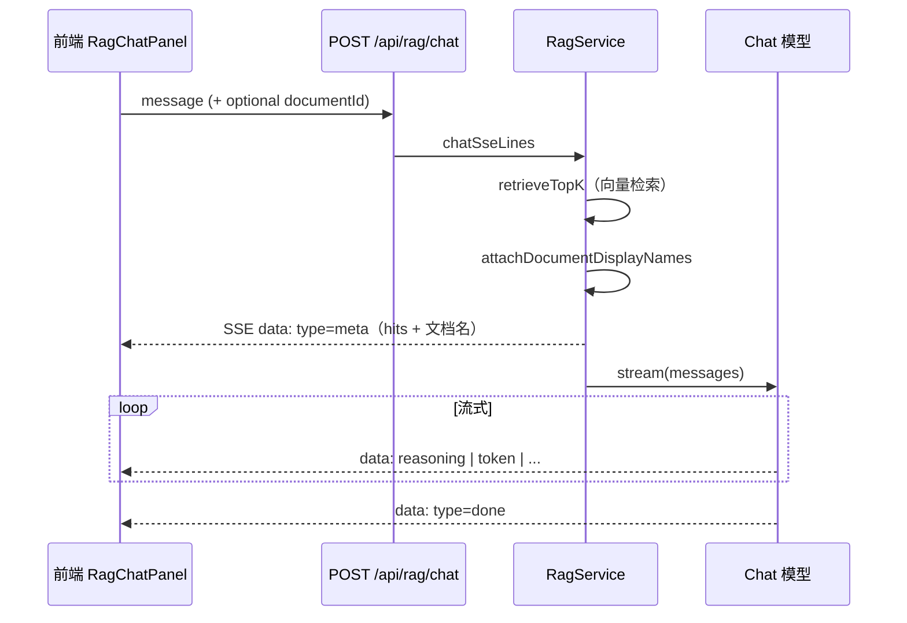

# RAG 流式对话、SSE meta 与引用匹配说明

本文说明本项目 **RAG 聊天（SSE）** 的事件顺序、**meta** 载荷字段，以及前端如何在 **流式生成正文** 的同时做 **引用条展示与高亮**（trigram 重叠 + 哨兵文本）。

---

## 1. 整体流程

1. 后端先做 **embedding 检索**，得到 topK `hits`（含 `content`）。
2. 立刻 **`yield` 一条 `type: 'meta'`**，前端据此缓存「本轮检索片段」及文档展示名。
3. 再调用 LLM **流式**输出：`reasoning`（若有）、`token`（正文增量）、最后 `done`。

前端对 **`meta.hits` 全程保留**，每收到正文 token 追加到 `answerMd`，并用 **当前累计正文** 与每条 hit 的 **片段正文 `content`** 做匹配，更新引用按钮高亮。

---

## 2. SSE `meta` 字段约定

| 字段 | 类型 | 说明 |
|------|------|------|
| `type` | `'meta'` | 固定 |
| `filterDocumentId` | `string \| null` | 请求里限定检索的 `documentId`，未限定为 `null` |
| `filterDocumentName` | `string \| null` | **限定检索时**：根据 `filterDocumentId` 查表 `rag_documents`，取 **`filename`** 作为展示名；库中无记录或文件名为空时 **回退为该 id**。未限定检索时为 `null`。 |
| `dimensions` | `number` | 向量维度 |
| `totalChunksCompared` | `number` | 本轮参与相似度比对的 chunk 条数 |
| `hitCount` | `number` | `hits.length` |
| `hits` | 数组 | 见下表 |

### `hits[]` 每一项

| 字段 | 说明 |
|------|------|
| `chunkId` | 切片主键 |
| `documentId` | 所属文档 id（`rag_documents.id`） |
| `documentName` | **`rag_documents.filename`**；若查不到文档则回退为 `documentId` |
| `chunkIndex` | 文档内序号 |
| `score` | 余弦相似度 |
| `content` | 切片正文；供前端 **流式重叠匹配**（与 prompt 内片段顺序一致） |

**说明**：`filterDocumentName` 与每条 hit 上的 `documentName` 都来自 **`Document.filename`**（Prisma：`rag_documents.filename`），便于 UI 显示人类可读文件名；逻辑 id 仍以 `documentId` 为准。

---

## 3. 为何 meta 要带 `content`

纯检索列表只能显示「来自哪个 chunk」，无法在模型 **边生成边输出** 时判断「当前句子更像在复述哪条片段」。  
因此 meta 中每条 hit 携带 **`content`**，前端在内存中缓存，与 **已累计的回答字符串** 做轻量相似度（不必再请求后端）。

---

## 4. 引用匹配策略（前端 `lib/rag-citation-match.ts`）

### 4.1 字符 trigram 覆盖率

将正文与片段做简单规范化后，取 **字符 trigram 集合**，计算：**片段中有百分之多少的 trigram 出现在已生成正文中**。超过阈值（默认约 **6%**，见 `CITATION_TRIGRAM_THRESHOLD`）则认为当前正文与该片段 **高度相关**，点亮对应引用按钮。

- 优点：实现简单、无需 tokenizer，中英文混杂也可用。
- 缺点：短句、改写幅度大时可能漏检或误检，阈值需按业务微调。

### 4.2 哨兵（sentinel）

系统 prompt 将检索结果排版为 `[片段 1]…`、`[片段 2]…`（与 **`hits` 数组顺序**一致）。若模型在回答中复述 **「片段 n」「第 n 个片段」** 等固定句式，可用正则直接映射到 **`hits[n-1]`**，视为命中（不必依赖文本重叠）。

**「哨兵」在此处的含义**：人为约定的、可被正则锚定的 **引用标记文本**，而不是 tokenizer 里的特殊词元。

### 4.3 更强方案（未默认启用）

- 让模型输出固定机读格式，例如 `[^chunk:<uuid>]`，前端只解析标记。
- 用 embedding 对「回答滑窗」与片段做相似度（准确度更高，依赖向量调用或 WASM）。

---

## 5. UI 行为摘要（`RagChatPanel.tsx`）

- **Think**：推理内容（如有）；正文开始后默认折叠（详见组件内状态）。
- **引用来源**：排在 **正文 Markdown 之上**；每个 hit 一个按钮，匹配成功用 **primary** 高亮，`title` 显示重叠比例及是否哨兵命中。
- **meta 摘要行**：含 **`filterDocumentName`（限定时）**、维度、比对块数、命中数。

---

## 6. 相关代码路径

| 层级     | 路径                                                                             |
| ------ | ------------------------------------------------------------------------------ |
| SSE 组装 | `back_end/src/rag/rag.service.ts`（`chatSseLines`、`attachDocumentDisplayNames`） |
| Prompt | `back_end/src/rag/prompt.ts`                                                   |
| 前端解析   | `my-app/lib/rag-sse-parse.ts`                                                  |
| 引用打分   | `my-app/lib/rag-citation-match.ts`                                             |
| 页面     | `my-app/app/ragSearch/RagChatPanel.tsx`                                        |

---

## 7. 检索接口 `POST /api/rag/search`

返回体中的 `results` 与 chat 的 meta 一致，已对每条 hit 调用 **`attachDocumentDisplayNames`**，含 **`documentName`** 字段，便于列表页与对话页展示统一。
